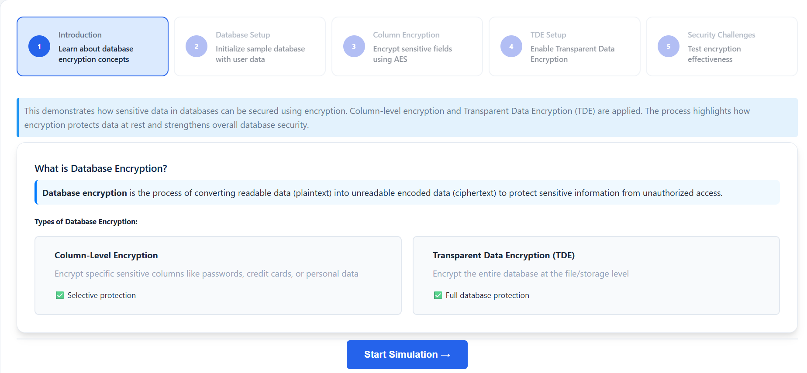
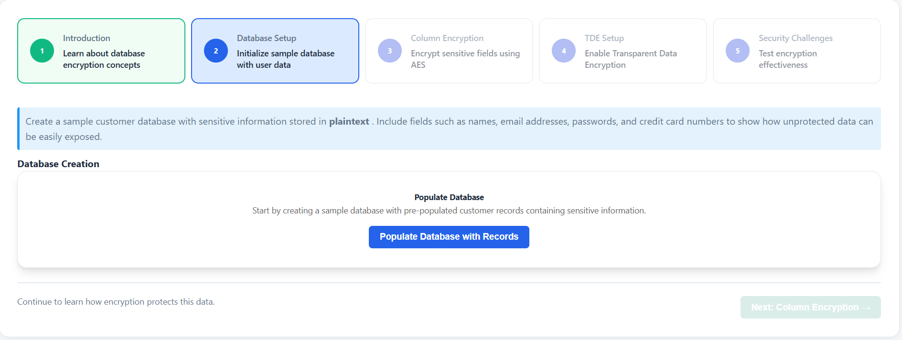
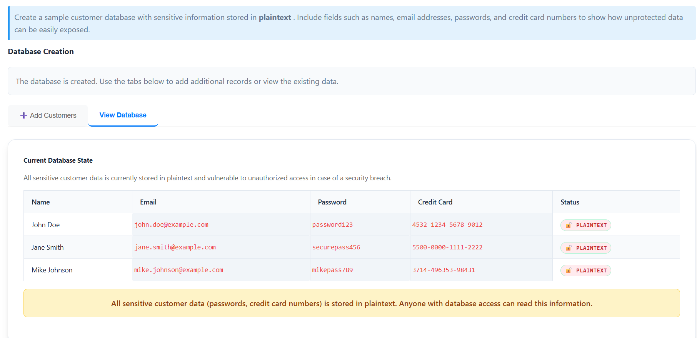
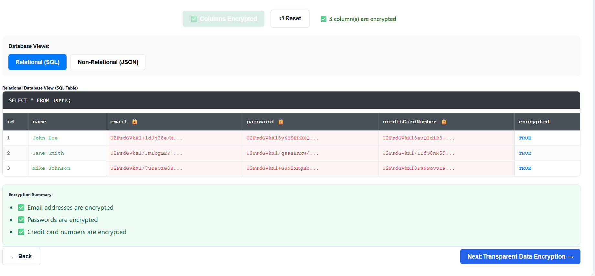
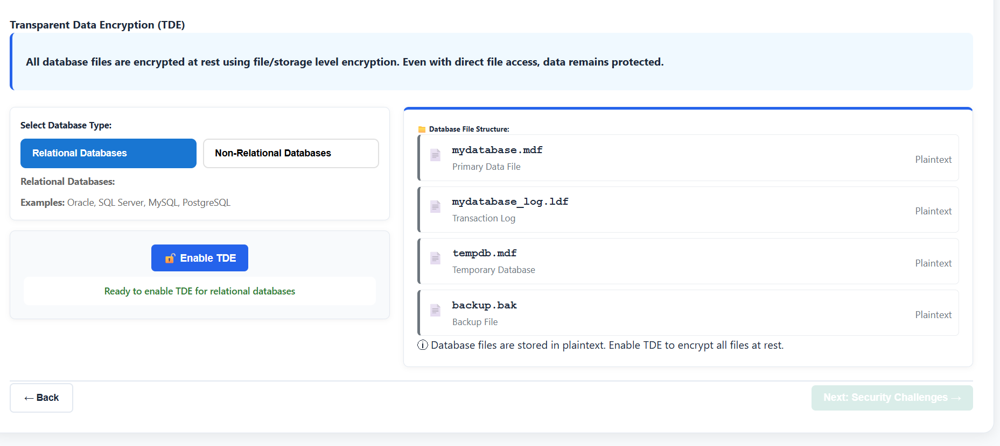
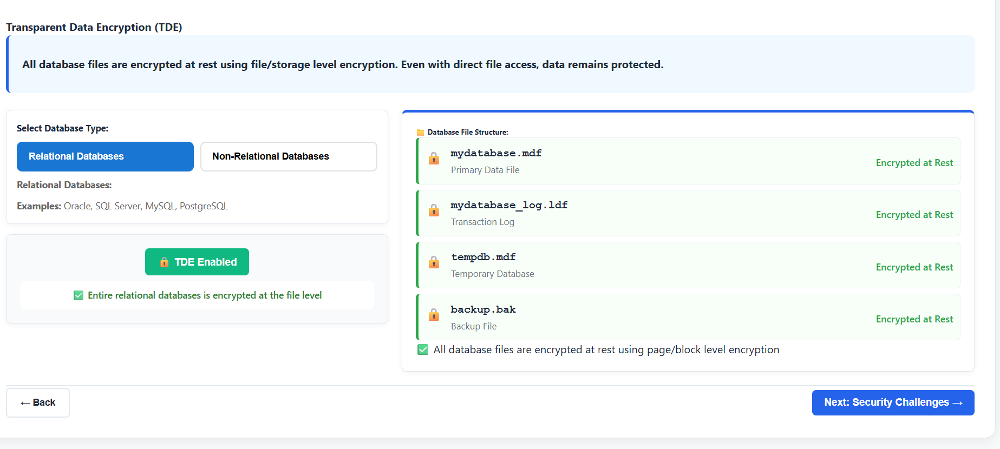
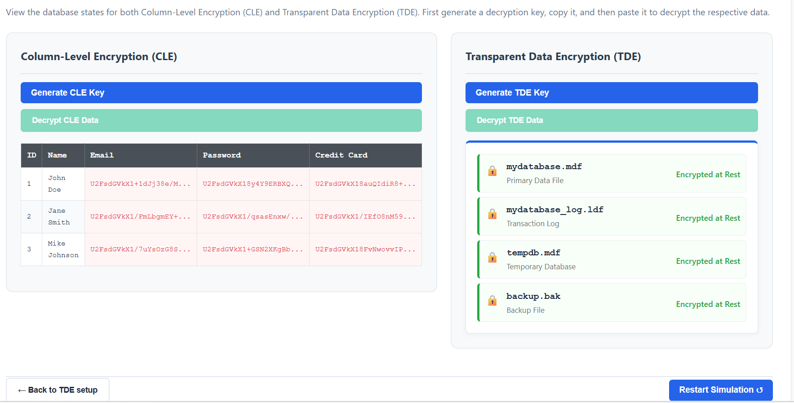
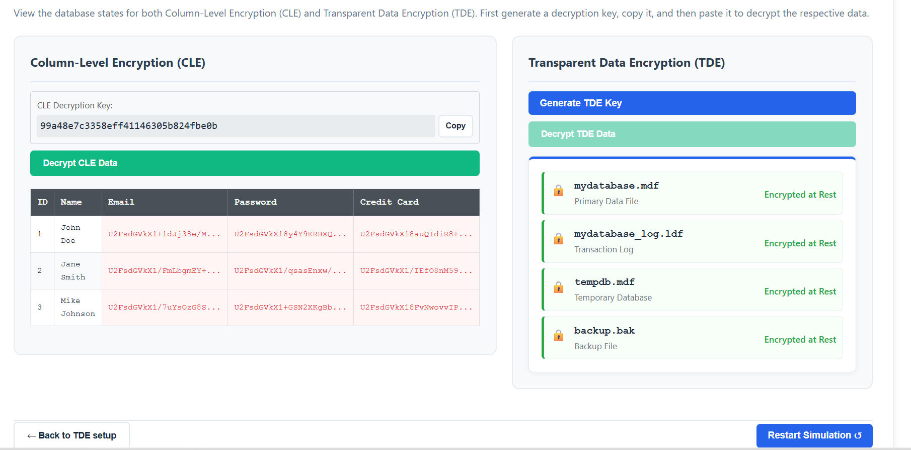
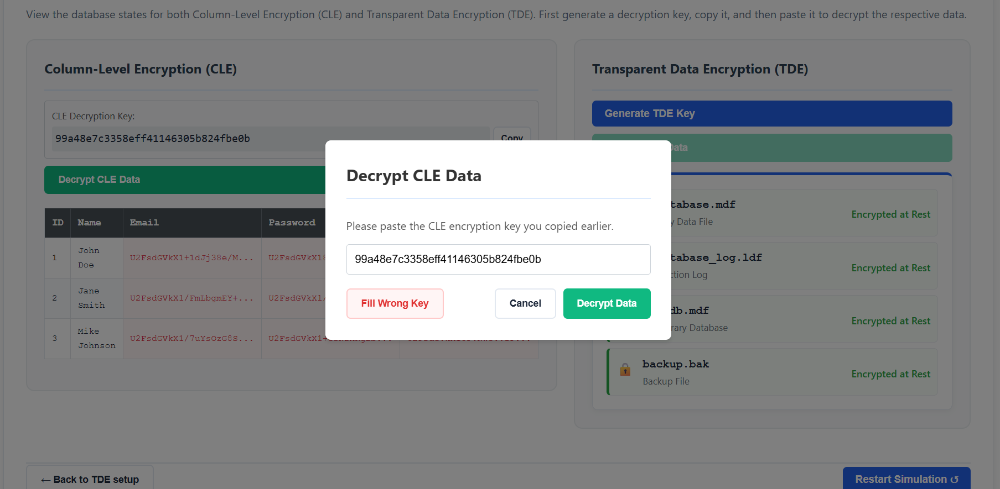
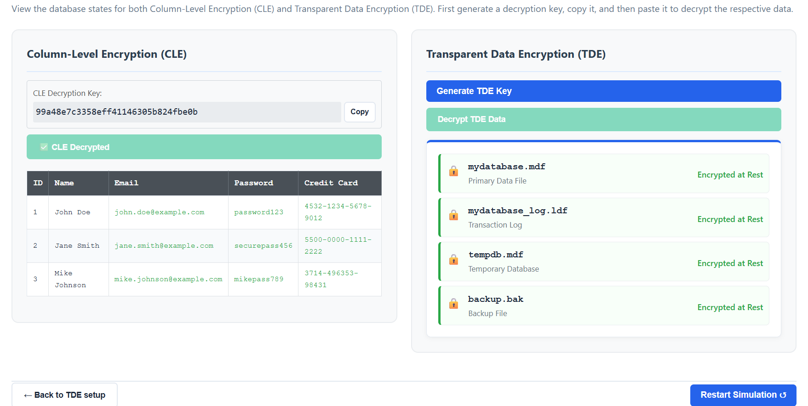

### **Step 1: Introduction and Learning Concepts**
1. Read the overview of database encryption.
2. Understand the differences between **Column-Level Encryption** and **Transparent Data Encryption (TDE)**.
3. Observe how encryption converts plaintext data into unreadable ciphertext to prevent unauthorized access.
4. Click **"Start Simulation →"** to begin the process.

### **Step 2: Database Setup**
1. Click **"Populate Database with Records"** to initialize a sample customer database.

2. Explore the loaded records in the **"View Database"** tab.
3. Identify sensitive fields such as **Passwords** and **Credit Card Numbers** that are currently stored in **plaintext**.

4. Use the **"Add Customers"** tab to manually add new records and see how unprotected data is exposed.
5. Click **"Next: Column Encryption →"** to proceed.

### **Step 3: Implementing Column-Level Encryption**
1. Learn about AES (Advanced Encryption Standard) encryption.
2. Select the specific columns you want to protect (e.g., Email Address, Password, Credit Card).
3. Click **"Encrypt Selected Columns"** to apply encryption to the sensitive fields in the database.
4. Toggle between **"Relational (SQL)"** and **"Non-Relational (JSON)"** views to see how the encrypted data looks in different database formats.

5. Click **"Next: Transparent Data Encryption →"** to continue.

### **Step 4: Enabling Transparent Data Encryption (TDE)**
1. Select a database type ("Relational" or "Non-Relational") to see its TDE implementation details.

2. Click "Enable TDE" to encrypt the entire database at the file level.

3. Observe the "Database File Structure" panel to see how data files, log files, and backups are secured.
4. Verify that the encryption status badges now reflect "TDE Encrypted".
5. Click "Next: Security Challenges →" to move to the testing phase.

### **Step 5: Security Testing and Decryption**
1. This step demonstrates the effectiveness of encryption and the importance of key management.

2. **For Column-Level Encryption (CLE):**
    - Click **"Generate CLE Key"** to create a decryption key.

    - Click **"Copy"** to copy the key to your clipboard.
    - Click **"Decrypt CLE Data"**, paste the key in the popup, and observe the data returning to plaintext.

3. **For Transparent Data Encryption (TDE):**
    - Click **"Generate TDE Key"** and copy it.
    - Click **"Decrypt TDE Data"**, paste the key, and witness the database files becoming accessible again.

4. Experiment with entering a **"Wrong Key"** to see how encryption effectively blocks unauthorized access.
5. Once finished, you can click **"Restart Simulation ↺"** to try different encryption configurations.