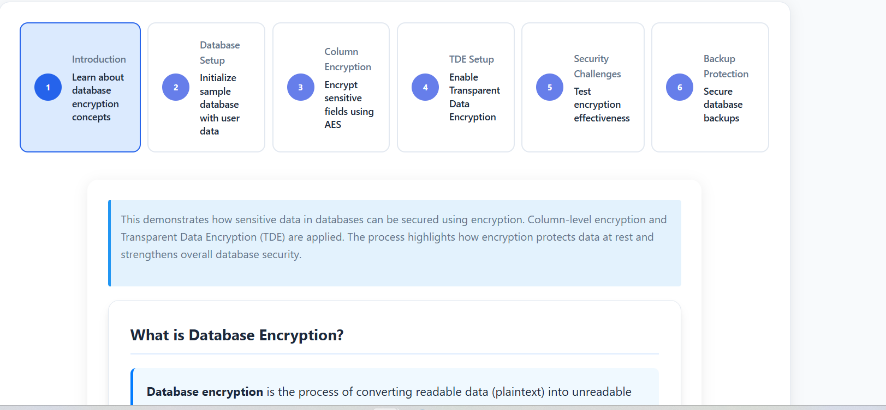
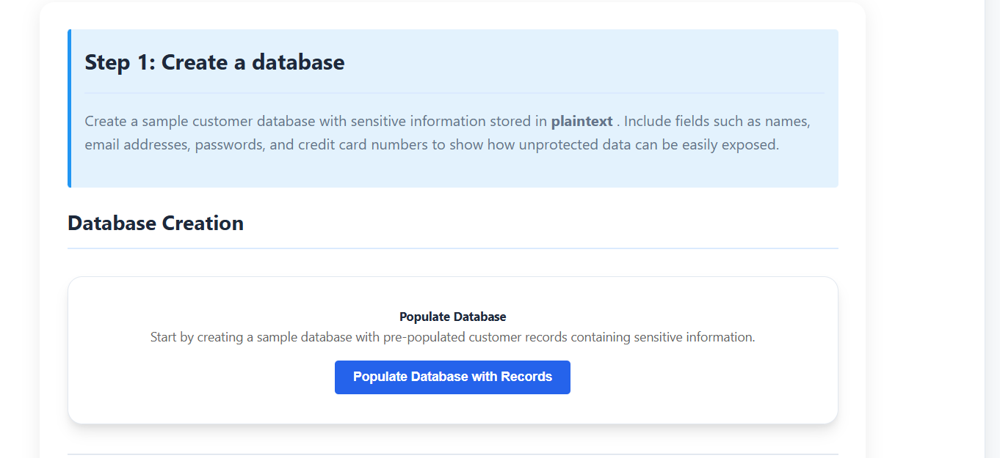
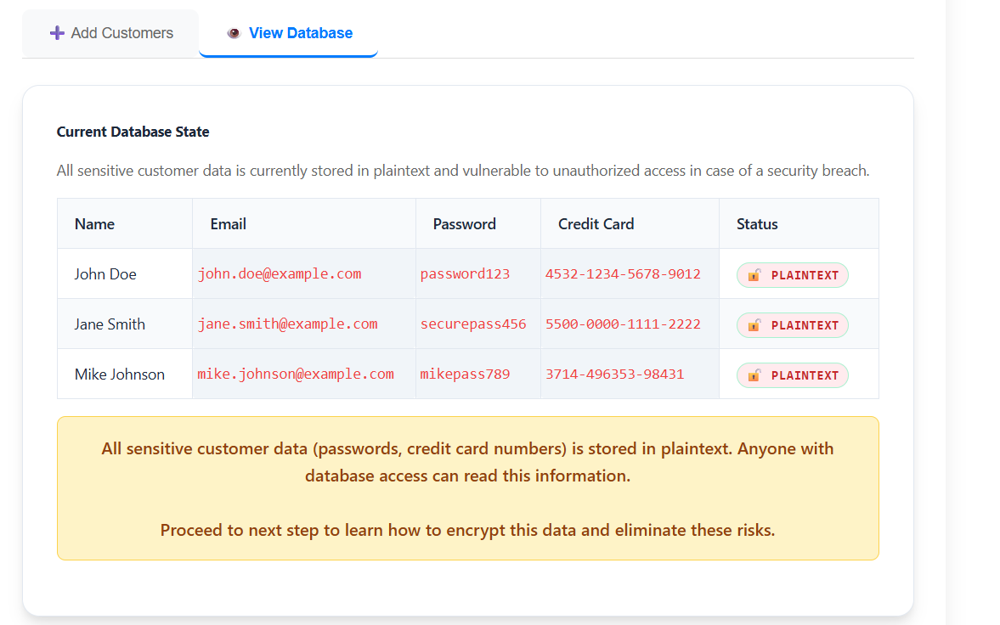
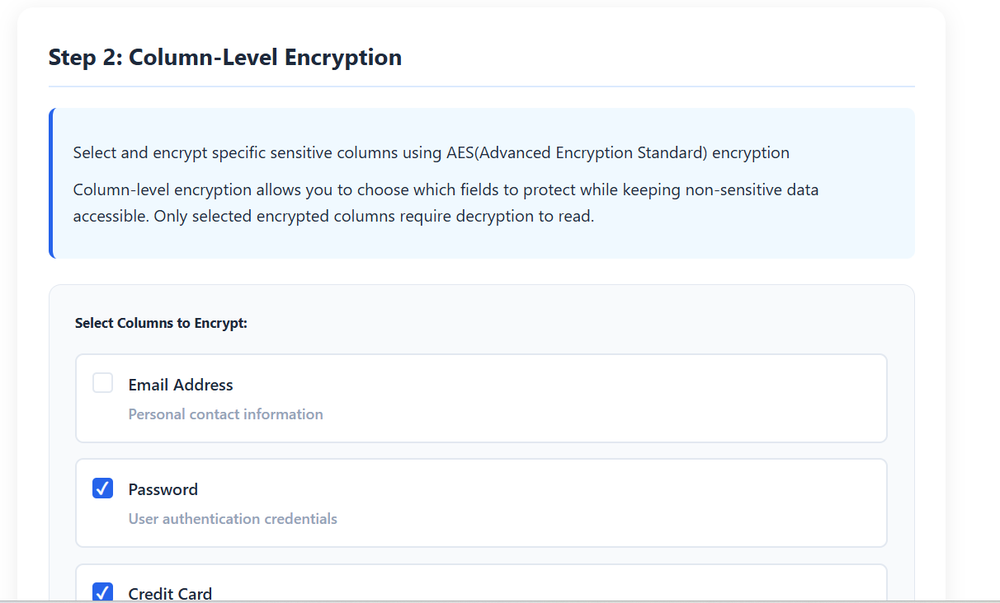
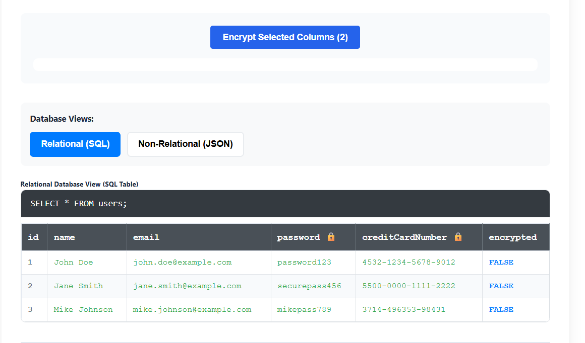
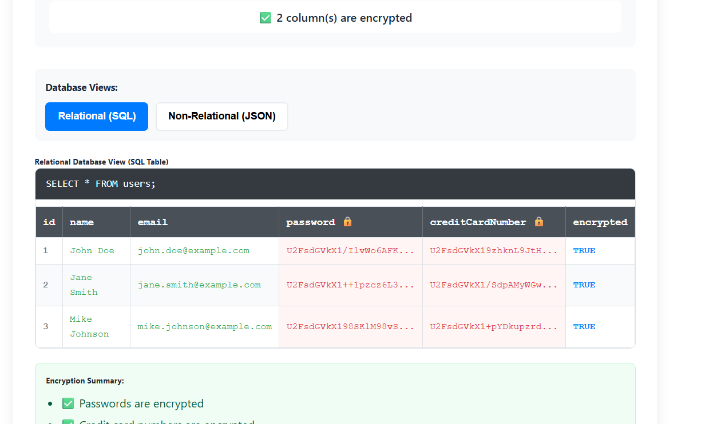
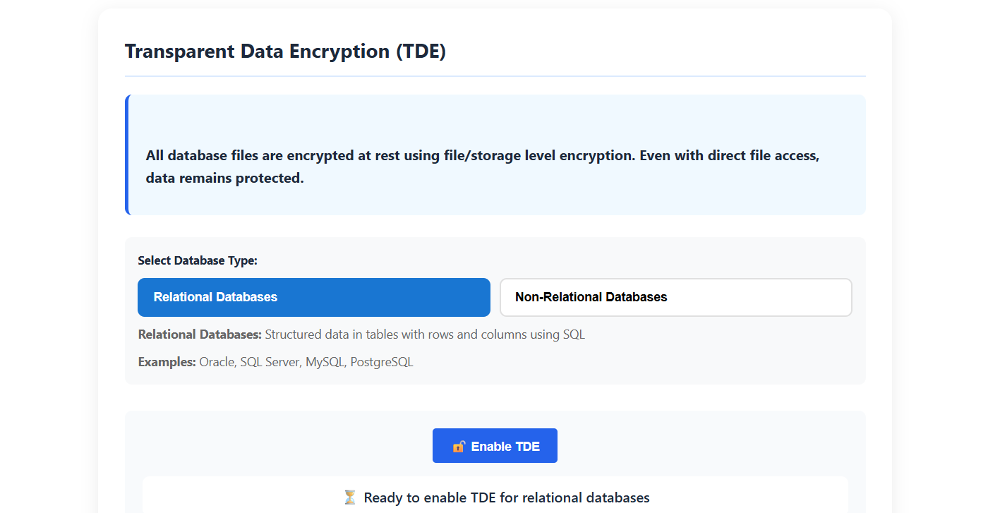
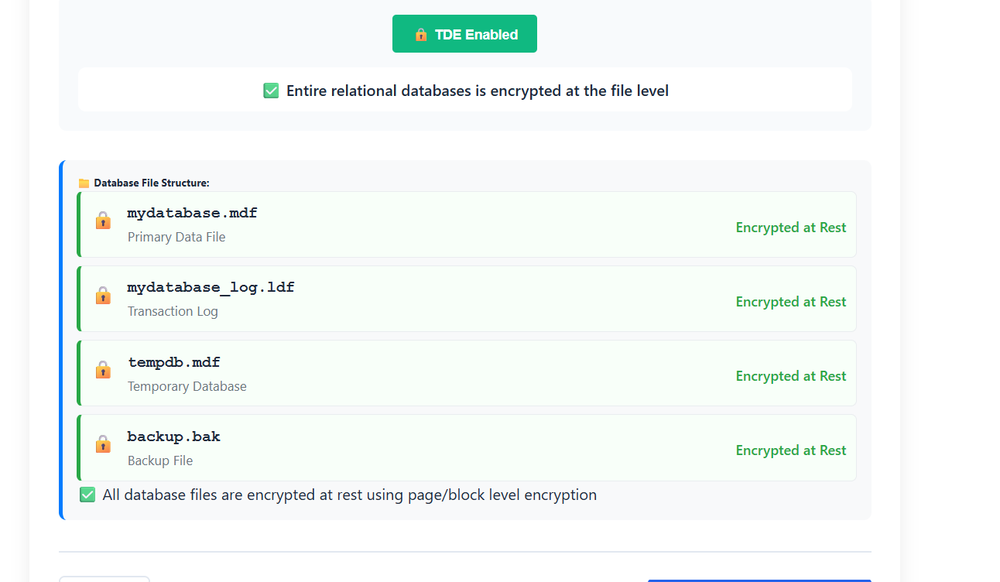
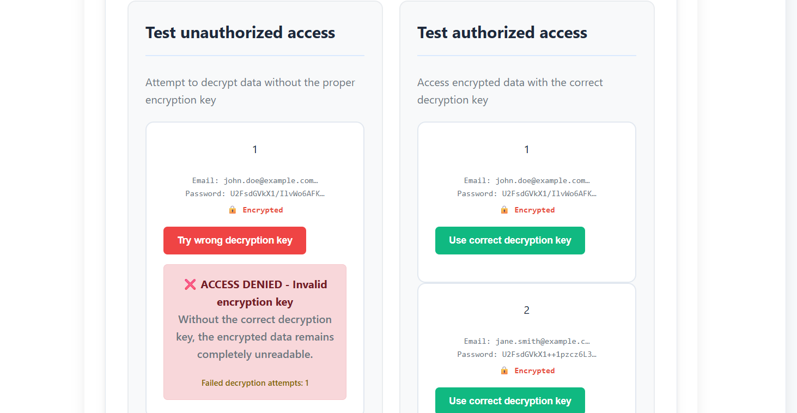
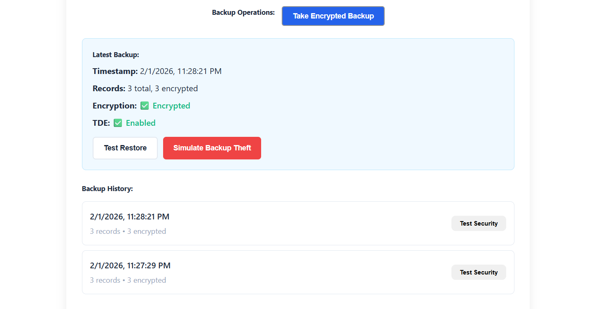

**Step 1: Introduction & Database Setup**

**Understand Database Encryption Concepts** – Recognize the difference between plaintext and encrypted data, and learn about different encryption approaches such as column-level versus full database encryption.

  
&nbsp;

**Initialize Sample Database** – Create a database with customer records, populate it with sample data including sensitive fields such as name, email address, password, and credit card number (all stored in plaintext), and confirm that all sensitive data is initially stored unencrypted.
  
&nbsp;
  
&nbsp;

**Step2 Implement Column-Level Encryption**

**Select Columns for Encryption** – Choose specific sensitive columns to encrypt, with recommended selections being the password field and the credit card number field.
  
&nbsp;

**Apply AES Encryption to Selected Columns** – Use database-specific AES encryption functions to encrypt the selected columns and update all existing records with the encrypted values.
  
&nbsp;

**Verify Column Encryption** – Confirm that the encrypted columns display ciphertext instead of plaintext, and verify that the encryption flag is set to TRUE for all encrypted records.
  
&nbsp;

**Step 4: Implement Transparent Data Encryption (TDE)**

**Select Database Type** – Identify whether a relational (SQL) database such as Oracle, SQL Server, MySQL, or PostgreSQL is being used, or a non-relational database, to determine the appropriate TDE implementation method.

  
&nbsp;

**Enable TDE** – Execute the specific Transparent Data Encryption (TDE) enablement commands for your DBMS, such as creating a database encryption key with AES_256 and enabling encryption on the database using server certificates.

  
&nbsp;

**Step 5: Test Encryption Effectiveness**

**Simulate Unauthorized Access** – Attempt to decrypt the data without the proper encryption key, verify that the "ACCESS DENIED - Invalid encryption key" error message appears, confirm that the encrypted data remains unreadable, and document all failed decryption attempts.

  
&nbsp;

**Step 6: Implement Backup Protection**

**Create Encrypted Backups**– Use backup commands with encryption options to create secure, encrypted backups of the database.

  
&nbsp;
